# 🏎️ DriveF1 - Car Rental Service

Welcome to **DriveF1**, a premium Formula 1-themed car rental system. This platform allows users to book from a curated collection of high-performance F1 cars and enables admins to manage bookings, feedback, and user data efficiently.

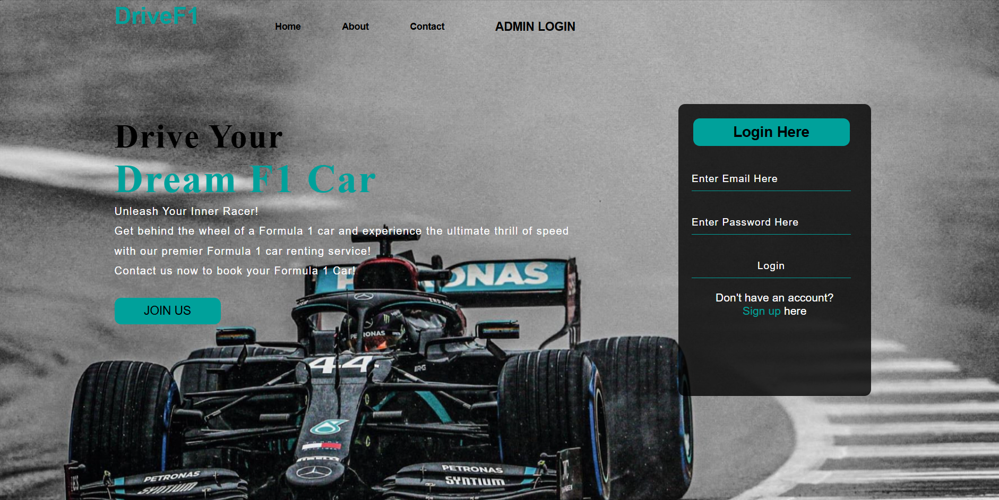

---

## 🚀 Features

### 👤 User Side:
- User Registration & Login
- Car Booking Interface
- View Booking Status
- Submit Feedback
- Explore F1 Car Collections
- About & Contact Pages

### 🛠️ Admin Side:
- Admin Login
- View and Manage User Bookings
- Collect and View User Feedback
- Manage Car Collections
- View Registered Users

---

## 📂 Pages Preview

| Page                  | Preview                              |
|-----------------------|--------------------------------------|
| Home                  |              |
| About Us              | 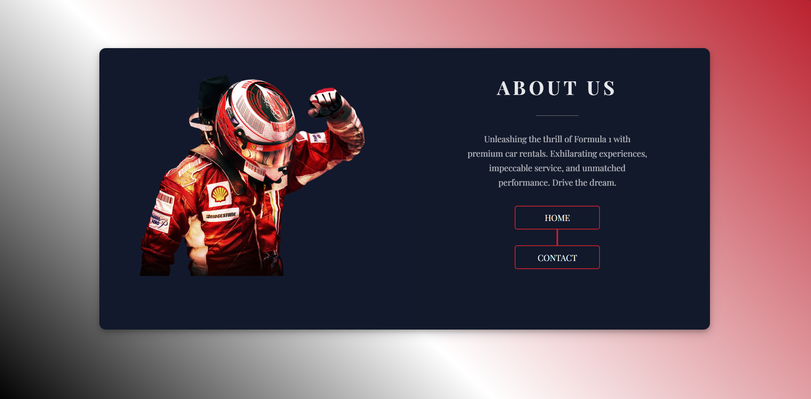           |
| Contact Us            | 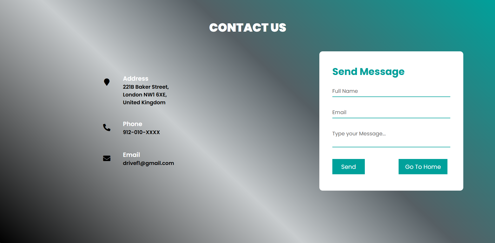       |
| User Signup           | 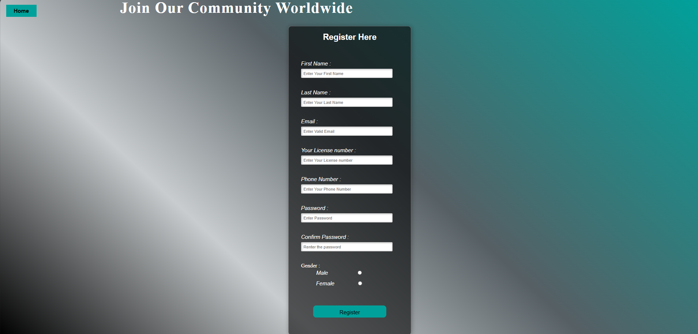     |
| User Booking          | 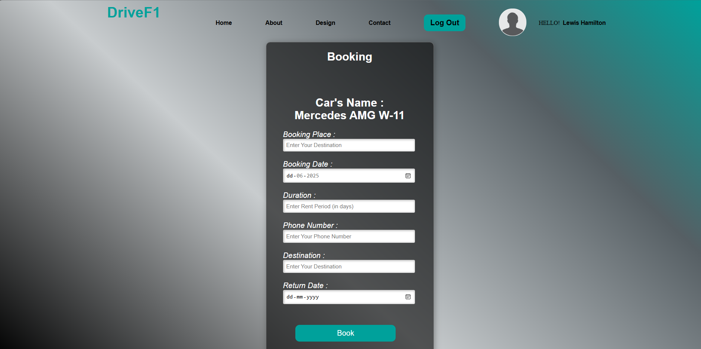|
| Booking Status        | 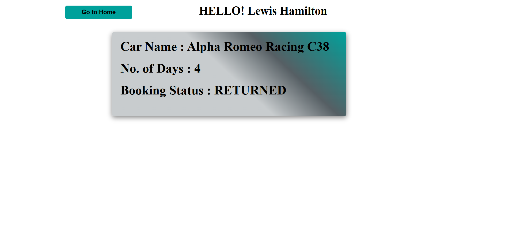|
| Submit Feedback       | 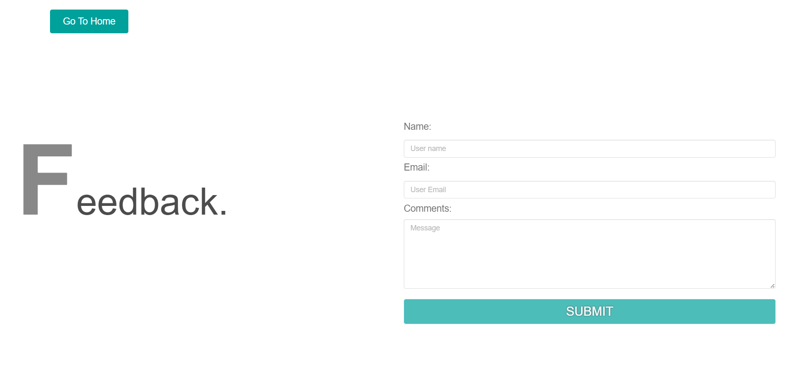|
| User Home             | 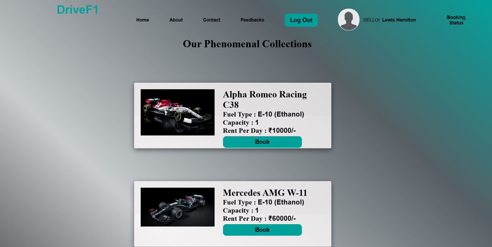     |
| Admin Login           | 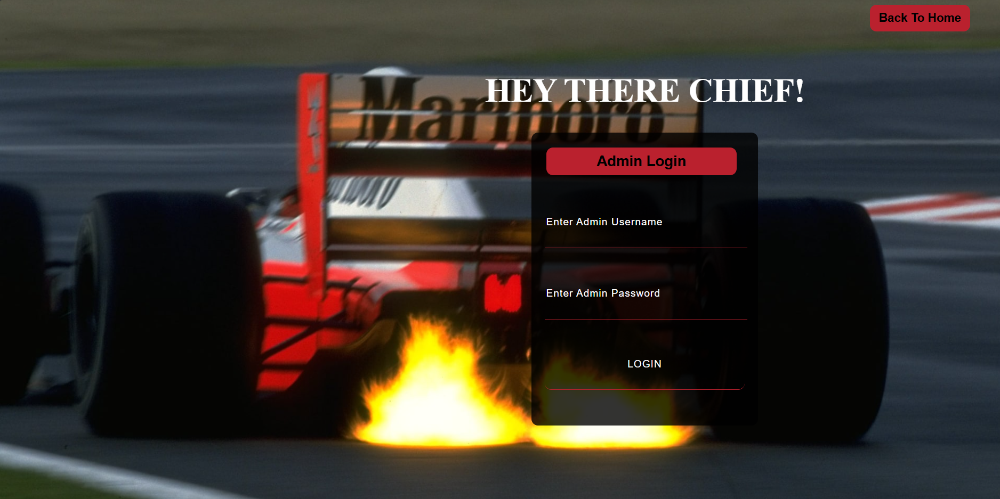 |
| Admin Booking         | 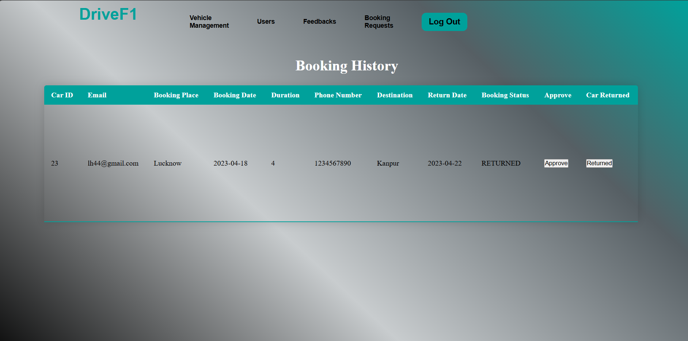|
| Admin Collection      | 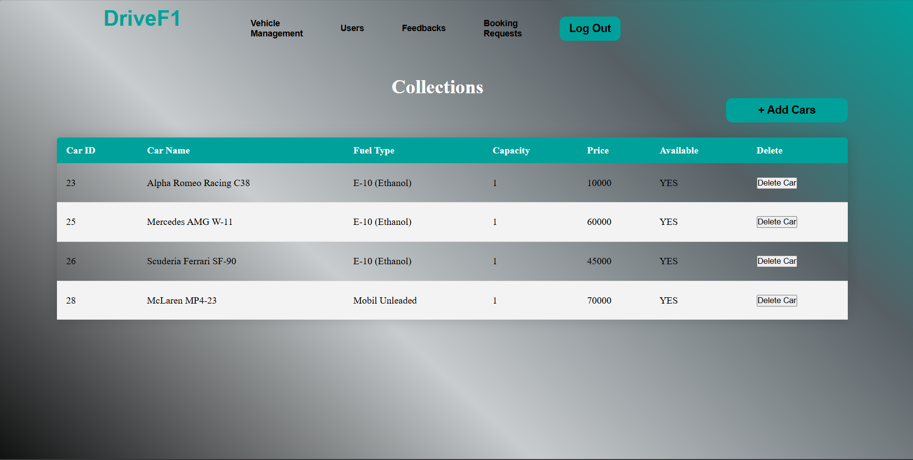|
| Admin Feedback        | 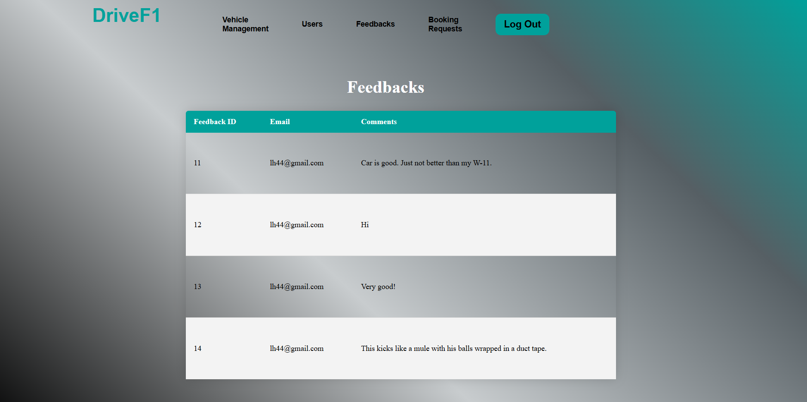|
| Admin Users           | 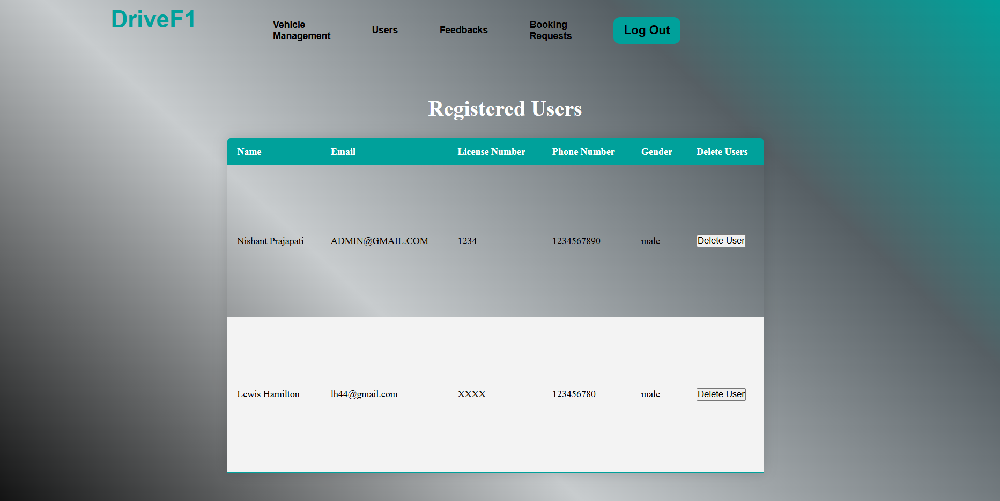   |

---

## 🧑‍💻 How to Run the Project

### 1. Install Local Server Environment

Install [XAMPP](https://www.apachefriends.org/index.html) or any similar PHP server stack (WAMP, MAMP, LAMP).

### 2. Place the Project in the Server Directory

Move or copy the folder `DriveF1---Car-Rental-Service-main` into your XAMPP `htdocs` directory:
```bash
C:\xampp\htdocs\DriveF1---Car-Rental-Service-main
```

### 3. Start Apache and MySQL

Open XAMPP Control Panel and start:
- Apache
- MySQL

### 4. Set Up the Database

- Open your browser and go to:
  ```bash
  http://localhost/phpmyadmin
  ```
- Create a new database named "carrental"
- Click on Import tab and upload the "carrental.sql" file included in the project

### 5. Configure Database Connection

Open the file (usually connection.php) and ensure the following:
```php
$host = 'localhost';
$user = 'root';
$password = '';
$db = 'carrental';
```

### 6. Launch the Project

Navigate to:
```bash
http://localhost/DriveF1---Car-Rental-Service-main/
```
If "index.php" is present, it will load automatically.


## 🛡️ License
This project is for educational/demo purposes only.
